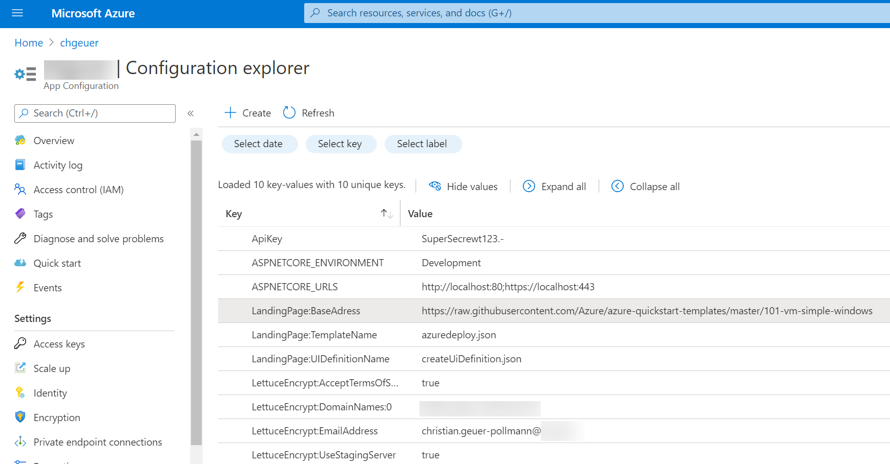

# `chgeuer/AzureSaaSProvisioningCustomARM` - ARM deployments originating from a SaaS offering

### tl;dr

This sample demonstrates the following scenario:

- Customer buys a SaaS application
- On the 'landing page' of the SaaS application, customer finds a 'Deploy to Azure' button
- Once clicked, the customer get's redirected to 'their' Azure portal, and can deploy an ARM template **which has been customized by the ISV for this particular customer**. 

### Why we need this sample

In our scenario, the ISV sells a SaaS offering to the customer, but also needs the customer to deploy some required resources into the customer's subscription. This deployment must be customized, for example with information required to properly tap back into the SaaS offering. This customization must be on a per-customer basis. 

From a user experience point of view, we do not want to ask the customer to run a generic ARM deployment, and copy/paste parametrization from the SaaS app's configuration page into the ARM deployment. 

Instead, the customer should just click the 'Deploy to Azure' button, and have a properly customized environment spinning up. 

What exactly this customization is, completely depends on the needs and requirements of the ISV. This sample just demonstrates a simple mechanism, on how to parametrize ARM template files and UI definitions on-the-fly, on a per-customer basis.

#### Marketplace intro

The Azure Marketplace has various mechanisms to allow ISVs to publish their offerings, namely 

- VM images
- Managed Applications 
  - an ARM-based deployment running in the customer's subscription, 
  - managed by the ISV, 
  - the customer explicitly being denied from managing the resources
- Solution Templates 
  - an ARM-based deployment running in the customer's subscription, 
  - customer having full access to the deployment
- SaaS offerings 
  - All SaaS-related resources running outside of the customer's Azure environment, usually on the ISV side.

### How Azure deployments through the portal work

When an Azure user clicks on of these  buttons (as we can find in all the [`Azure/azure-quickstart-templates`](https://github.com/Azure/azure-quickstart-templates)), these links trigger a URL which looks like this:

```text
https://portal.azure.com/#create/Microsoft.Template/uri/...
```

or like this

```text
https://portal.azure.com/#create/Microsoft.Template/uri/.../createUIDefinitionUri/...
```

In this code, the `...` part is a URI-encoded value pointing to an ARM template, or a UI definition. For example the part after `/uri/` could be `https%3A%2F%2Fraw.githubusercontent.com%2FAzure%2Fazure-quickstart-templates%2Fmaster%2F100-marketplace-sample%2Fazuredeploy.json`. This is a URI-encoded URL, with `%3A` representing a `:` and `%2F` representing a `/`. 

When the Azure portal app experiences such a deployment request (the `#create/Microsoft.Template/uri/...` stuff), the portal's backend fetches the required JSON files, and populates the UI for deployment.

In case of the [`Azure/azure-quickstart-templates`](https://github.com/Azure/azure-quickstart-templates), the template links point towards GitHub's `raw.githubusercontent.com` server, where the literal JSON can be fetched. 

If you click the sample below, you can try it out yourself:


##### Sample

[](https://portal.azure.com/#create/Microsoft.Template/uri/https%3A%2F%2Fraw.githubusercontent.com%2FAzure%2Fazure-quickstart-templates%2Fmaster%2F100-marketplace-sample%2Fazuredeploy.json/createUIDefinitionUri/https%3A%2F%2Fraw.githubusercontent.com%2FAzure%2Fazure-quickstart-templates%2Fmaster%2F100-marketplace-sample%2FcreateUiDefinition.json)

### How it works

In the `Index.cshtml` page, we simply present the customer with the deployment button:

```html
<a href="@Model.DeploymentURL">
   
</a>
```

In the backing code, the `DeploymentURL` is created on demand:

```csharp
var prefix = "https://portal.azure.com/#create/Microsoft.Template";
DeploymentURL = info.HasCustomUI
  ? $"{prefix}/uri/{encoded(info.TemplateName)}/createUIDefinitionUri/{encoded(info.UIDefinitionName)}"
  : $"{prefix}/uri/{encoded(info.TemplateName)}";
```

The big difference to the Azure Quickstart templates is that our sample doesn't point to a static file URL, but to the app's `DeploymentController` API. So when the Azure tries to fetch the ARM template, it hits our own site. 

The 'magic' sits in the `encoded()` function, which takes the customer-specific parametrization data, and encrypts & signs it (using JOSE / JSON Object Signing and Encryption). A concrete template URL (prior URL encoding) could look like this:

```json
"https://www.saas-landingpage.contoso.com/api/Deployment/eyJhbGciOiJQTM....NuQ5hED4g/azuredeploy.json"
```

In this example,

-  `www.saas-landingpage.contoso.com` is our own landing page
- `/api/Deployment` part points to the `DeploymentController` API
- `eyJhbGciOiJQTM....NuQ5hED4g` is a JOSE-encrypted (and signed) payload which will be decrypted by the `DeploymentController` , and then be used to parametrize the JSON files, before giving them to Azure.
- The part after the JOSE payload (`azuredeploy.json` in this example) is the actual file to be fetched. 

By making the (encrypted) parametrization part of the path, the solution can simply point to other assets (nested templates, shell scripts, etc.), without breaking the `"[deployment().properties.templateLink.uri]"` [mechanism](https://docs.microsoft.com/en-us/azure/azure-resource-manager/templates/template-functions-deployment#remarks) in your ARM template. 

### Customizing this sample

This sample ships with a trivial on-the-fly modification (implemented in `SampleParametrization`):

```c#
using Newtonsoft.Json.Linq;
using Utils;

public class SampleTemplateParametrization : IPatcherGenerator
{
    /* This type demonstrates how client-specific information
     * (like `SomeClientInformation`) can be used to 
     * parametrize ARM templates, or createUIDefinitions.*/
    public string SomeClientInformation { get; set; }

    IContentPatcher IPatcherGenerator.CreatePatcher() 
    {
        void patchARM(JObject json)
        {
            var variables = json.SelectToken("$.variables");
 
            variables["dynamically_injected"] = new JObject(
                new JProperty("some_client_stuff", this.SomeClientInformation));
        }

        void patchUI(JObject json)
        {
            json["$greetings"] = this.SomeClientInformation;
        }

        return new GenericJSONPatcher(patchARM: patchARM, patchUI: patchUI);
    }
}
```

In this example, the only information we need for parametrization is the `SomeClientInformation` string. We create a 'patcher', which is configured to patch both ARM templates (in the `patchARM` function), and UI definitions (in the `patchUI` function).

The ARM template is handed to our code as a `Newtonsoft.Json.Linq.JObject`, which we can modify. As you can see, the code adds an additional ARM variable called `dynamically_injected`. For the `createUiDefinition.json` file, I just added a `$greetings` string property to the root of the document.

However, you have full control over the JSON structure, and can do whatever you like. 

### Configuration

This sample stores the majority of its configuration inside an Azure App Configuration instance, but you can easily change that to a different mechanism, just swap out `Microsoft.Azure.AppConfiguration.AspNetCore` and use something else.

#### Assumptions

This sample assumes that there is an unparametrized ARM template etc. sitting somewhere in HTTP space. **This sample only supports a single template**. In the screenshot below, you can see a few configuration settings:

- `LandingPage:BaseAddress` contains HTTP address relative to which all file names will be evaluated.  Traditionally, that would be the one showing up in `"[deployment().properties.templateLink.uri]"`.
- `LandingPage:TemplateName` is the filename of the main ARM template. Usually, it's something like `azureDeploy.json`, but doesn't have to be. 
- `LandingPage:UIDefinitionName`: *If* your deployment should leverage some wizard-like UI experience in the Azure portal, you can point towards your `createUiDefinition.json` (in case you have one).
- `ApiKey`: In our app, the `Index.cshtml` page generates an encrypted token so that the `DeploymentController` can decrypt and validate the signature. I'm currently using the `ApiKey` setting as content encryption key and HMAC key for the JOSE library.




### Prevent HTTP caching

When a customer deploys an ARM template to the Azure portal via a link like `https://portal.azure.com/#create/Microsoft.Template/uri/...`, 
the Azure portal's backend system fetches the ARM template, and potentially UI definitions. The URI-encoded URLs in the fragment of the 
address point the concrete JSON files for a deployment. The Azure backend issues an unauthenticated HTTP GET to fetch the JSON files.

The Azure backend's HTTP client respects HTTP headers, like cache durations. The can become a problem in situations where an asset 
should not be cached. The `NoCacheAttribute` in the solution prevents Azure from caching. 